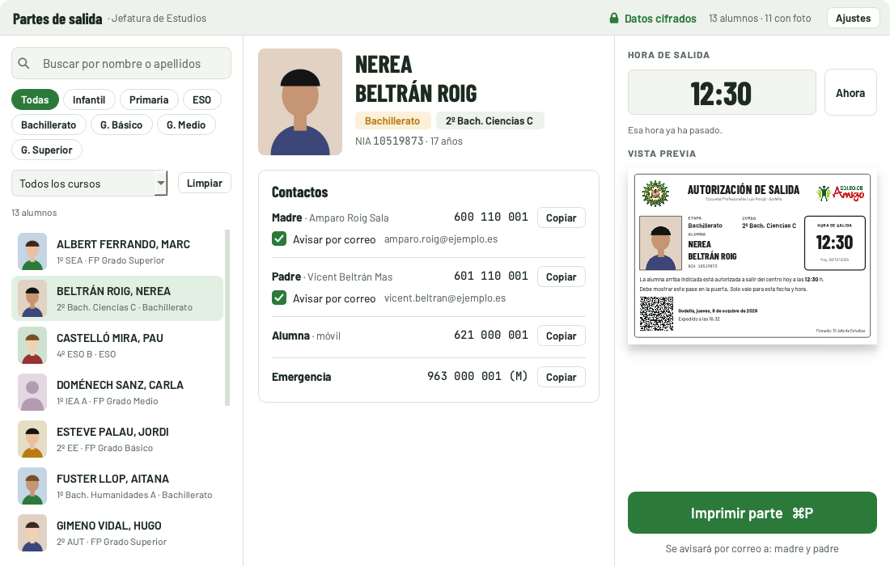

# Partes de salida

Aplicación de escritorio (macOS y Windows) de las **Escuelas Profesionales Luis Amigó (EPLA)** que imprime en **DIN-A6** el pase de salida de un alumno —foto, etapa, curso, nombre, hora de salida, sello, firma y un QR firmado— y, si se marca, avisa a la familia por correo.



- **Sin servidor y sin nube.** Los datos del alumnado se importan del Excel de Educamos y de los ZIP de fotos, y se guardan **cifrados** en el equipo. Para rehacer un equipo basta con volver a importarlos.
- **Cada jefatura en su equipo.** Cada instalación tiene sus propios logos, sello, firma, textos y etapas visibles, sin interferir con las demás.
- **QR firmado** (Ed25519) para que la futura app Android del vigilante distinga un parte auténtico de uno falso.
- Se actualiza sola: avisa de cada versión nueva publicada en este repositorio.

> [!WARNING]
> Repositorio **público**: aquí no entra ningún dato del alumnado, ninguna foto ni ninguna contraseña. `.gitignore`, el gancho `.githooks/pre-commit` y `tests/test_seguridad.py` lo impiden.

## Instalar

Descargar la última versión en [Releases](https://github.com/cferrerobonet/partes_salida/releases/latest):

| Sistema | Archivo |
| --- | --- |
| macOS | `PartesSalida_vX.Y.Z_macOS.dmg` (si dice que está dañada, ver el `LÉEME` del DMG) |
| Windows | `PartesDeSalida-X.Y.Z-Windows-Setup.exe` · sin permisos de administrador: `…-Windows-Portable.zip` |

Primer uso: **Ajustes → Datos del alumnado** → importar el Excel y los ZIP de fotos; **Sello y firma**; **Correo** (contraseña y correo de prueba); **Impresión** (impresora con bandeja A6 y parte de prueba). Guía completa en [docs/OPERACIONES.md](docs/OPERACIONES.md).

## Desarrollo

```bash
make venv        # entorno en ~/.venvs/partes-salida (fuera de iCloud) + Chromium para Playwright
make ganchos     # activa el gancho de git que impide subir datos
make run         # abre la app
scripts/qa.sh todo   # ruff + tests (unitarios, interfaz, correo en navegador)
```

**No se compila en local**: al publicar una etiqueta `vX.Y.Z`, GitHub Actions compila Windows y macOS y los adjunta al release (skill `publicar`).

## Documentación

| Documento | Para qué |
| --- | --- |
| [docs/README.md](docs/README.md) | Mapa de toda la documentación |
| [docs/ESPECIFICACION.md](docs/ESPECIFICACION.md) | Qué hace la app, para quién y con qué criterios |
| [docs/ARQUITECTURA.md](docs/ARQUITECTURA.md) | Módulos, flujo de datos y cómo extenderla |
| [DESIGN.md](DESIGN.md) | Sistema de diseño (tokens, tipografía, ventanas, parte impreso) |
| [docs/SEGURIDAD_Y_DATOS.md](docs/SEGURIDAD_Y_DATOS.md) | Datos personales, cifrado, firma y correo |
| [docs/DECISIONES.md](docs/DECISIONES.md) | Registro de decisiones (ADR) |
| [docs/OPERACIONES.md](docs/OPERACIONES.md) | Instalar, publicar, restaurar y resolver problemas |
| [docs/PENDIENTE.md](docs/PENDIENTE.md) | Hoja de ruta, pendientes y hallazgos |
| [CONTRIBUTING.md](CONTRIBUTING.md) | Cómo trabajar en el repositorio |
| [CHANGELOG.md](CHANGELOG.md) | Historial de versiones |
| [android/README.md](android/README.md) | App del vigilante (verificación del QR) |

Licencia MIT.
