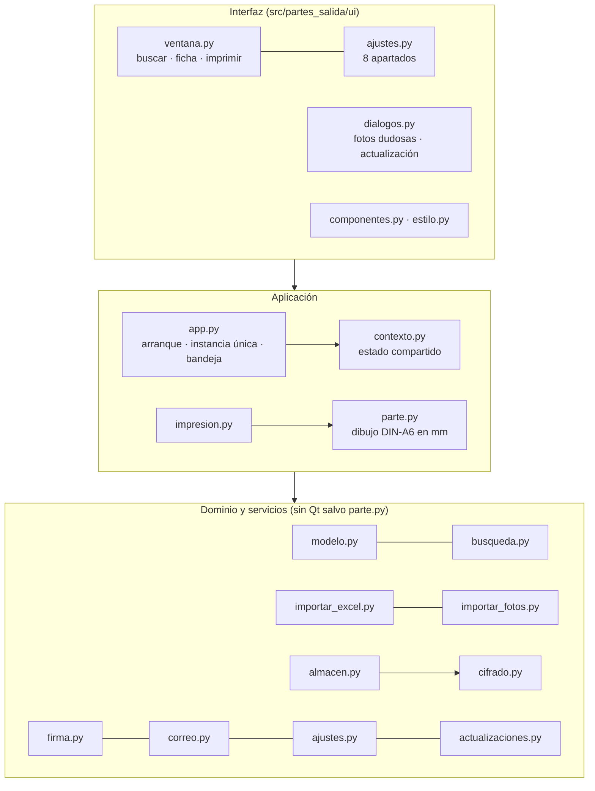
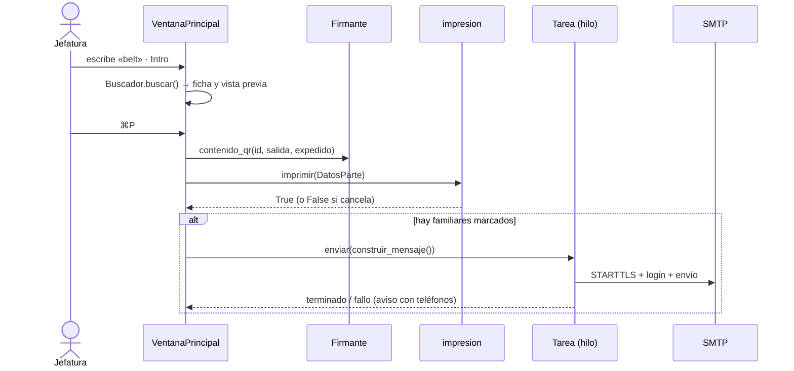

# Arquitectura

## 1. Vista general

App de escritorio monolítica en **Python 3.11 + PyQt6**, sin servidor. Tres capas con dependencias hacia abajo:



- **Dominio puro** (`modelo`, `busqueda`, `importar_*`, `cifrado`, `almacen`, `firma`, `correo`, `ajustes`, `fechas`): sin Qt, probado con pytest sin pantalla.
- **`parte.py`** usa QtGui (QPainter) porque el mismo dibujo sirve para pantalla e impresora.
- **`contexto.py`** reúne el estado compartido (ajustes, claves, padrón, buscador, caché de miniaturas) y emite `padron_cambiado` y `ajustes_cambiados`; la UI se suscribe.

## 2. Módulos

| Módulo | Responsabilidad | Notas |
| --- | --- | --- |
| `app.py` | `main()`: registro, `QApplication`, instancia única (`QLocalServer`), icono de bandeja, prueba de arranque de la CI, aviso de actualización | Entrada: `src/main.py` |
| `rutas.py` | Carpeta de datos por sistema; recursos dentro del paquete o de la app congelada | `PARTES_SALIDA_DATOS` la cambia (tests) |
| `modelo.py` | `Alumno`, `Tutor`, etapa y curso desde CLASE, claves de nombre sin tildes | Dataclasses serializables |
| `importar_excel.py` | `.xls` (xlrd) y `.xlsx` (openpyxl) → `ResultadoExcel`; solo `COLUMNAS` | Cabeceras normalizadas sin tildes |
| `importar_fotos.py` | ZIP en memoria → JPEG 360×480 → `Almacen`; emparejado exacto y parecido (RapidFuzz) | Progreso por callback |
| `cifrado.py` | AES-256-GCM con clave en el llavero (`keyring`); secretos | Sin llavero: archivo local con aviso |
| `almacen.py` | `alumnado.bin` y `fotos/<hmac>.bin` cifrados; escritura atómica | `DatosIlegibles` si la clave cambió |
| `busqueda.py` | Prefijos sin tildes en cualquier orden; si no hay, tolerancia a erratas | Filtros de etapa, clase y etapas visibles |
| `firma.py` | Contenido del QR firmado Ed25519 y verificación | Contrato con Android |
| `parte.py` | `dibujar_parte(painter, px_por_mm, …)`; `imagen_parte()` para la vista previa | Textos que se ajustan solos |
| `impresion.py` | `QPrinter` A6 horizontal, directa o con diálogo; ajuste fino; parte de prueba | |
| `correo.py` | Mensaje HTML + texto con logos `cid:`; envío SMTP (STARTTLS o SSL) | Siempre en un hilo |
| `ajustes.py` | `Ajustes` (JSON), imágenes propias, exportar e importar | Sin datos ni contraseñas |
| `actualizaciones.py` | Última versión en GitHub (API y plan B por la web), descarga solo desde GitHub | Igual que Guardias |
| `sistema.py` | Registro rotatorio + faulthandler; arranque con la sesión (LaunchAgent / clave Run) | |
| `ui/estilo.py` | Tokens claro y oscuro, hoja de estilos, tipografías, iconos dibujados | Fuente de verdad visual |
| `ui/ventana.py` | Ventana principal: lista con delegado, ficha, vista previa, impresión y aviso | |
| `ui/ajustes.py` | Ventana de Ajustes; importaciones en `Tarea` (QThread) | |

## 3. Flujos

### Emitir un parte



### Importar

`ZonaSoltar` → `Tarea(importar_excel | importar_fotos)` → `Contexto.nuevo_padron()` / `fotos_cambiadas()` → señales → la ventana recarga etapas, cursos, lista y recuento.

## 4. Almacenamiento en el equipo

```
<carpeta de datos>/                 macOS: ~/Library/Application Support/PartesSalida
├── alumnado.bin                    Windows: %APPDATA%\PartesSalida
├── fotos/<hmac del id>.bin
├── ajustes.json                    sin datos personales ni contraseñas
├── imagenes/{logo_izquierdo,logo_derecho,sello,firma}.png
└── logs/app_AAAAMMDD.log · faulthandler.log
Llavero del sistema (servicio «PartesSalida»): clave-datos · clave-firma · smtp:<usuario>
```

Formato de cada `.bin`: `PS1` + nonce (12 bytes) + AES-GCM(datos) con datos asociados (`alumnado` o `foto:<id>`), que impiden intercambiar archivos.

## 5. Hilos

La interfaz nunca espera a la red ni al disco largo: importar y enviar correo van en `componentes.Tarea` (`QThread`) con señales `progreso`, `terminado` y `fallo`; la ventana guarda la referencia hasta que termina. La comprobación de actualizaciones usa un hilo de Python y vuelve a la interfaz por una señal (`dialogos._Puente`).

## 6. Cómo extender

| Quiero… | Dónde |
| --- | --- |
| Leer otra columna del Excel | `importar_excel.COLUMNAS` + campo en `Alumno` + ADR + [SEGURIDAD_Y_DATOS.md](SEGURIDAD_Y_DATOS.md) |
| Cambiar la maquetación del parte | `parte.dibujar_parte` (coordenadas en mm) + `make capturas` + parte de prueba impreso |
| Un ajuste nuevo | campo en `ajustes.Ajustes` (con valor por defecto: los JSON antiguos siguen valiendo) + control en `ui/ajustes.py` |
| Otra etapa | `modelo.ETAPAS`, `ORDEN_ETAPAS`, `ETAPA_CORTA` |
| Cambiar el QR | `firma.py` + `android/ESPECIFICACION_QR.md` + `make vectores` + versión mayor |
| Un registro de partes emitidos | Se descartó (ADR-009): la salida se registra en Educamos |

## 7. Pruebas

`tests/` con pytest: dominio sin pantalla, interfaz con pytest-qt (`QT_QPA_PLATFORM=offscreen`), correo en Chromium con Playwright y datos reales solo en local (`-m datos_reales`). Datos ficticios en `tests/ficticios.py`. La CI (`comprobar.yml`) pasa todo en cada push; `compilar.yml` además arranca la app compilada en Windows y macOS.
